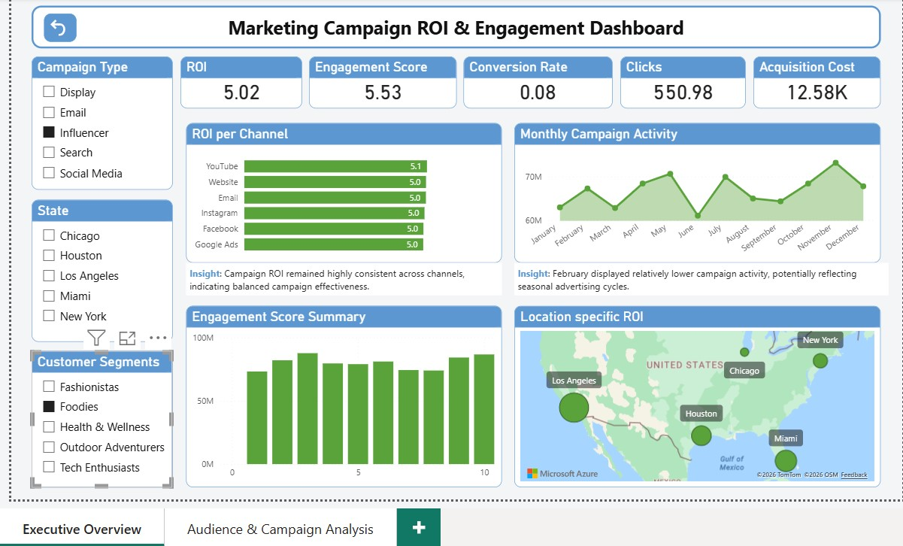
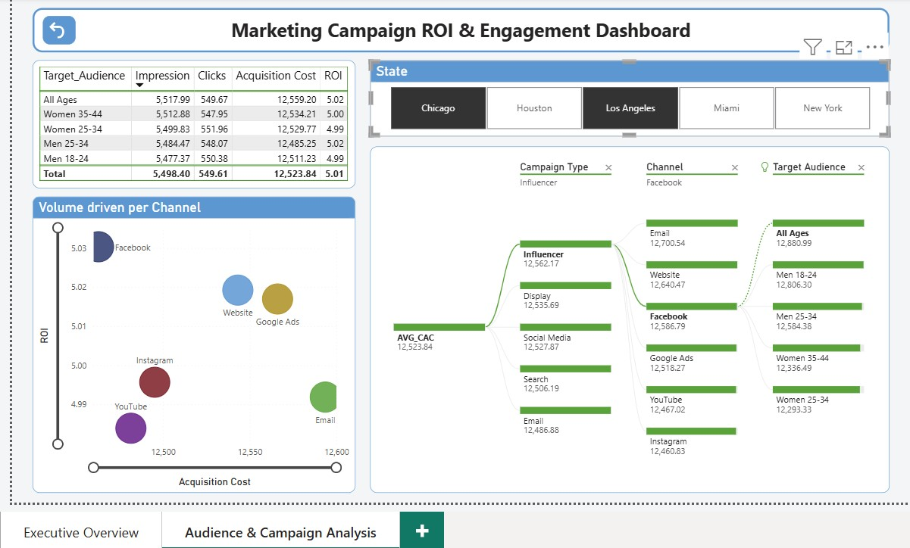

# Marketing Campaign ROI & Engagement Dashboard

This project analyzes marketing campaign performance across channels, audience segments, and campaign types to evaluate ROI, engagement, conversion efficiency, and acquisition cost trends.

## Tools Used

- SQL (MySQL)
- Power BI
- Power Query
- DAX
- Excel/CSV

## KPIs Analyzed

- ROI
- Conversion Rate
- Engagement Score
- Acquisition Cost
- Clicks
- Impressions

## Dashboard Features

- Executive KPI overview
- Channel-wise ROI analysis
- Monthly campaign activity tracking
- Audience segmentation analysis
- Geographic ROI mapping
- Decomposition tree analysis
- Scatter plot relationship analysis

## Key Insights

- Campaign ROI remained relatively consistent across channels and campaign types.
- February displayed relatively lower campaign activity compared to other months.
- Acquisition cost distribution remained stable across campaign channels.
- Display campaigns showed marginally higher engagement levels.

## Skills Demonstrated

- SQL querying
- KPI analysis
- Dashboard storytelling
- DAX measure creation
- Data visualization
- Business interpretation
- Interactive dashboard development

## Dashboard Preview

### Page 1

### Page 2
